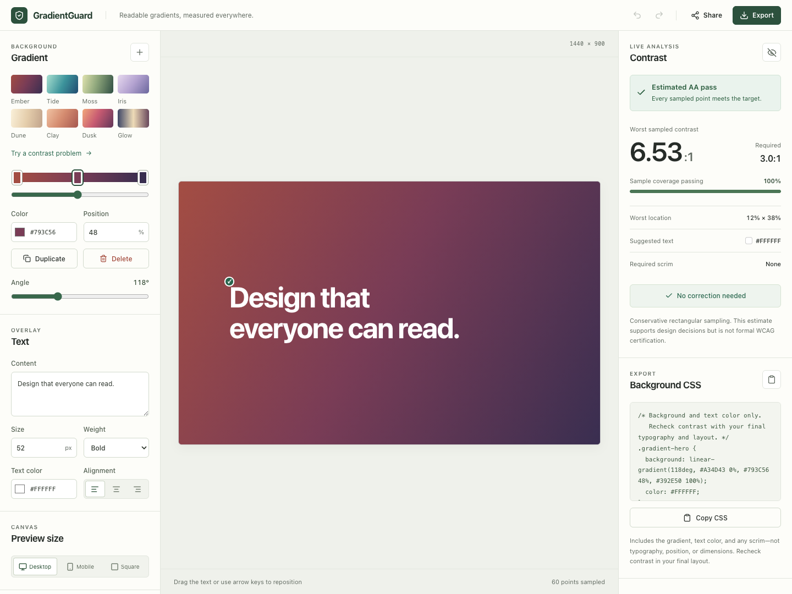

# GradientGuard

**Readable gradients, measured everywhere.**

[Open GradientGuard](https://gradient-guard.vercel.app/)

GradientGuard is an accessibility-first gradient editor for designers and developers. Ordinary contrast checkers compare two solid colors, while gradient tools often inspect only a midpoint. Both approaches can miss a small but important region where text becomes unreadable.

GradientGuard samples the full rectangular region occupied by the preview text, reports the worst sampled contrast, visualizes unsafe regions, and finds the least invasive practical correction.

## Screenshot



The editor opens with **Ember**, a terracotta-to-plum gradient with readable white text. The screenshot reflects the current code on this branch; the live site follows releases merged into `main`.

## What it does

- Includes eight curated presets: Ember, Tide, Moss, Iris, Dune, Clay, Dusk, and Glow
- Edits linear gradients with directly draggable color-stop handles, color pickers, position inputs, and angle control
- Configures representative text, typography, color, alignment, position, and frame size
- Samples rendered canvas pixels beneath the text after a short debounce
- Reports an estimated WCAG 2.2 AA result, worst ratio and location, and passing coverage
- Shows an optional low-opacity contrast heatmap
- Tries black and white text, then binary-searches for the minimum black or white scrim when needed
- Copies or downloads CSS for the gradient, text color, and optional scrim; shares versioned editor state through the URL
- Keeps changes local and supports undo/redo
- Uses a three-panel desktop workbench and mobile tabs that keep the preview visible while editing or inspecting results

## Using the editor

1. Start with Ember or choose another preset. Select **Try a contrast problem** below the presets to load a failing Tide example and reveal the results on mobile. Undo restores your previous design.
2. Drag the white-bordered handles on the gradient rail to move color stops. The slider below and position input stay synchronized. Add, duplicate, delete, or recolor stops as needed.
3. Enter representative text, adjust its size, weight, alignment, and color, then drag it in the preview.
4. Inspect the worst sampled contrast and heatmap. If the estimate fails, select **Make readable** and review the correction. Undo and redo let you compare changes.
5. Copy **Background CSS**, download it with **Export**, or use **Share** to copy a link to the configuration. The CSS includes the gradient, text color, and any scrim—not typography, position, or dimensions. Recheck contrast in the final layout; the exported CSS includes a reminder.

Focus a color-stop handle and use arrow keys to move it by 1%, or Shift + arrow keys for 10% steps. Home and End move it to the rail's endpoints. Focus the preview text to nudge it with arrow keys; hold Shift for larger steps.

## Contrast analysis

Color channels are linearized from sRGB, converted to relative luminance, and compared with `(lighter + 0.05) / (darker + 0.05)`. Normal text targets `4.5:1`; text at least 24px regular or 18.5px bold targets `3:1`. Analysis uses the preview text's computed font size and weight, not just the configured size: responsive text rendered at 18px bold targets `4.5:1`. The target is recalculated when the preview resizes.

The preview gradient is rendered to a device-pixel-ratio-aware canvas. After a 140ms debounce, GradientGuard reads a 12 × 5 grid of pixels (60 points) across the DOM text rectangle so the displayed and measured backgrounds share the same rendering source. The canvas redraws and analysis updates when the preview resizes. For correction, it first checks black and white text. If neither passes on every sampled point, a deterministic binary search finds the minimum contrasting scrim opacity, rounded up to whole-percent increments for application.

The text rectangle includes transparent glyph areas and is therefore intentionally conservative. Results are estimates and do not constitute formal accessibility certification.

## Architecture

`Editor state → Canvas renderer → Pixel sampler → Contrast engine → Fix optimizer → Exporter`

React's `useReducer` owns editor state and a bounded undo history. Pure modules contain color math, gradient interpolation, contrast thresholds, scrim optimization, and URL serialization. UI components stay focused on rendering and interaction.

## Local setup

Use Node.js 24 and pnpm 11, matching the runtime and package manager used to verify this project.

```bash
git clone https://github.com/timwong101/GradientGuard.git
cd GradientGuard
pnpm install
pnpm dev
```

Open the localhost URL printed by Vite. Dependency installation requires network access; rendering and analysis run locally in the browser without an account, backend, or API key. The production build is generated in `dist`.

## Tests

```bash
pnpm test
pnpm run build
pnpm exec playwright install chromium
pnpm run test:e2e
```

The unit suite covers luminance, known contrast ratios, large-text thresholds, gradient interpolation, minimum scrim search, URL validation, history, and the readable default preset. Playwright covers direct stop dragging and keyboard movement, the edit → move → detect → correct → export workflow, and mobile editing, undo/redo, sharing, downloads, and canvas resizing.

## Known limitations

- Linear gradients only; no radial, mesh, animated, or image backgrounds
- A conservative rectangular text region rather than glyph-outline sampling
- A finite grid of samples, not a check of every pixel; narrow unsafe regions between samples can be missed
- Browser canvas rendering can vary slightly by color profile and device
- CSS export includes the background, text color, and full-frame scrim; it does not recreate the preview's typography, text position, or dimensions
- Results describe the current preview and configured text settings; recheck contrast in the final layout
- The tool is a design aid, not an official WCAG certification service

## Privacy

All rendering, analysis, correction, history, and URL encoding happen in the browser. GradientGuard has no backend, analytics, accounts, or cloud persistence.

Shared links include your text and configuration in the URL. They are not encrypted; anyone with the link can read them. Use Share to retain a configuration across reloads, since ordinary edits are held in memory. Opening a hosted page still makes normal requests to its hosting provider.

## Future ideas

Radial gradients, image backgrounds, APCA analysis, glyph-aware or localized overlays, expanded export formats, and a future Figma integration are natural extensions after the core workflow is validated.
